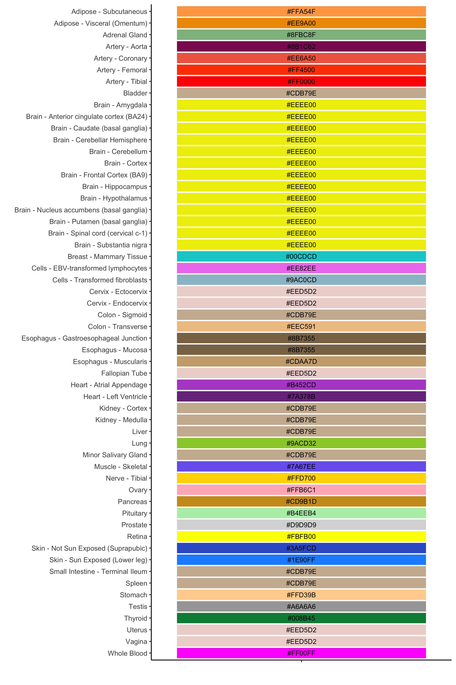

<!-- README.md is generated from README.Rmd. Please edit that file -->

# gtex_tissue_palette

<!-- badges: start -->
<!-- badges: end -->

The goal of gtex_tissue_palette is to provide a tab-delimited table of
GTEx tissue labels, associated colour HEX and RGB codes.

Data wrangled from the Broad Institute files [gene expression by
tissue](https://github.com/broadinstitute/gtex-public/blob/master/scripts/gene_expression_by_tissue.py)
and
[colors.json](https://raw.githubusercontent.com/broadinstitute/gtex-viz/7cfffd65f19fbcad216a0df3325cfd89e40d6952/boxplot/dev/colors.json)

``` r
library(tidyverse)
```

## Read data

``` r

setwd('~/Git/gtex_tissue_palette/')
gtx_tissue_col <- read_rds('gtex_tissue_col_hex.Rds')
```

``` r

gtx_tissue_col %>% arrange(desc(tissue_paste)) %>% tidyExt::print_all()
#> # A tibble: 56 × 7
#>    tissue_paste                      tissu…¹ smts  smtd  tissu…² tissu…³ tissu…⁴
#>    <chr>                             <chr>   <chr> <chr> <chr>   <chr>   <chr>  
#>  1 Whole_Blood                       Whole … Whol… Whol… WHLBLD  #FF00FF 2550255
#>  2 Vagina                            Vagina  Vagi… Vagi… VAGINA  #EED5D2 238213…
#>  3 Uterus                            Uterus  Uter… Uter… UTERUS  #EED5D2 238213…
#>  4 Thyroid                           Thyroid Thyr… Thyr… THYROID #008B45 013969 
#>  5 Testis                            Testis  Test… Test… TESTIS  #A6A6A6 166166…
#>  6 Stomach                           Stomach Stom… Stom… STMACH  #FFD39B 255211…
#>  7 Spleen                            Spleen  Sple… Sple… SPLEEN  #CDB79E 205183…
#>  8 Small_Intestine_Terminal_Ileum    Small … Smal… Term… SNTTRM  #CDB79E 205183…
#>  9 Skin_Sun_Exposed_Lower_leg        Skin -… Skin  Sun … SKINS   #1E90FF 301442…
#> 10 Skin_Not_Sun_Exposed_Suprapubic   Skin -… Skin  Not … SKINNS  #3A5FCD 5895205
#> 11 Retina                            Retina  Reti… Reti… RETINA  #FBFB00 2512510
#> 12 Prostate                          Prosta… Pros… Pros… PRSTTE  #D9D9D9 217217…
#> 13 Pituitary                         Pituit… Pitu… Pitu… PTTARY  #B4EEB4 180238…
#> 14 Pancreas                          Pancre… Panc… Panc… PNCREAS #CD9B1D 205155…
#> 15 Ovary                             Ovary   Ovary Ovary OVARY   #FFB6C1 255182…
#> 16 Nerve_Tibial                      Nerve … Nerve Tibi… NERVET  #FFD700 2552150
#> 17 Muscle_Skeletal                   Muscle… Musc… Skel… MSCLSK  #7A67EE 122103…
#> 18 Minor_Salivary_Gland              Minor … Mino… Mino… SLVRYG  #CDB79E 205183…
#> 19 Lung                              Lung    Lung  Lung  LUNG    #9ACD32 154205…
#> 20 Liver                             Liver   Liver Liver LIVER   #CDB79E 205183…
#> 21 Kidney_Medulla                    Kidney… Kidn… Medu… KDNMDL  #CDB79E 205183…
#> 22 Kidney_Cortex                     Kidney… Kidn… Cort… KDNCTX  #CDB79E 205183…
#> 23 Heart_Left_Ventricle              Heart … Heart Left… HRTLV   #7A378B 122551…
#> 24 Heart_Atrial_Appendage            Heart … Heart Atri… HRTAA   #B452CD 180822…
#> 25 Fallopian_Tube                    Fallop… Fall… Fall… FLLPNT  #EED5D2 238213…
#> 26 Esophagus_Muscularis              Esopha… Esop… Musc… ESPMSL  #CDAA7D 205170…
#> 27 Esophagus_Mucosa                  Esopha… Esop… Muco… ESPMCS  #8B7355 139115…
#> 28 Esophagus_Gastroesophageal_Junct… Esopha… Esop… Gast… ESPGEJ  #8B7355 139115…
#> 29 Colon_Transverse                  Colon … Colon Tran… CLNTRN  #EEC591 238197…
#> 30 Colon_Sigmoid                     Colon … Colon Sigm… CLNSGM  #CDB79E 205183…
#> 31 Cervix_Endocervix                 Cervix… Cerv… Endo… CVSEND  #EED5D2 238213…
#> 32 Cervix_Ectocervix                 Cervix… Cerv… Ecto… CVXECT  #EED5D2 238213…
#> 33 Cells_Transformed_fibroblasts     Cells … Cells Tran… FIBRBLS #9AC0CD 154192…
#> 34 Cells_EBV_transformed_lymphocytes Cells … Cells EBV   LCL     #EE82EE 238130…
#> 35 Breast_Mammary_Tissue             Breast… Brea… Mamm… BREAST  #00CDCD 0205205
#> 36 Brain_Substantia_nigra            Brain … Brain Subs… BRNSNG  #EEEE00 2382380
#> 37 Brain_Spinal_cord_cervical_c_1    Brain … Brain Spin… BRNSPC  #EEEE00 2382380
#> 38 Brain_Putamen_basal_ganglia       Brain … Brain Puta… BRNPTM  #EEEE00 2382380
#> 39 Brain_Nucleus_accumbens_basal_ga… Brain … Brain Nucl… BRNNCC  #EEEE00 2382380
#> 40 Brain_Hypothalamus                Brain … Brain Hypo… BRNHPT  #EEEE00 2382380
#> 41 Brain_Hippocampus                 Brain … Brain Hipp… BRNHPP  #EEEE00 2382380
#> 42 Brain_Frontal_Cortex_BA9          Brain … Brain Fron… BRNCTXB #EEEE00 2382380
#> 43 Brain_Cortex                      Brain … Brain Cort… BRNCTXA #EEEE00 2382380
#> 44 Brain_Cerebellum                  Brain … Brain Cere… BRNCHA  #EEEE00 2382380
#> 45 Brain_Cerebellar_Hemisphere       Brain … Brain Cere… BRNCHB  #EEEE00 2382380
#> 46 Brain_Caudate_basal_ganglia       Brain … Brain Caud… BRNCDT  #EEEE00 2382380
#> 47 Brain_Anterior_cingulate_cortex_… Brain … Brain Ante… BRNACC  #EEEE00 2382380
#> 48 Brain_Amygdala                    Brain … Brain Amyg… BRNAMY  #EEEE00 2382380
#> 49 Bladder                           Bladder Blad… Blad… BLDDER  #CDB79E 205183…
#> 50 Artery_Tibial                     Artery… Arte… Tibi… ARTTBL  #FF0000 25500  
#> 51 Artery_Femoral                    Artery… Arte… Femo… ARTFMR  #FF4500 255690 
#> 52 Artery_Coronary                   Artery… Arte… Coro… ARTCRN  #EE6A50 238106…
#> 53 Artery_Aorta                      Artery… Arte… Aorta ARTAORT #8B1C62 1392898
#> 54 Adrenal_Gland                     Adrena… Adre… Adre… ADRNLG  #8FBC8F 143188…
#> 55 Adipose_Visceral_Omentum          Adipos… Adip… Visc… ADPVSC  #EE9A00 2381540
#> 56 Adipose_Subcutaneous              Adipos… Adip… Subc… ADPSBQ  #FFA54F 255165…
#> # … with abbreviated variable names ¹​tissue_hr, ²​tissue_abbrv,
#> #   ³​tissue_color_hex, ⁴​tissue_color_rgb
```

Note
[**gtex_tissue_col_hex.tsv**](https://github.com/bansell/gtex_tissue_palette/blob/main/gtex_tissue_col_hex.tsv)
is also provided, but this does not preserve the factor order for
plotting.

To enforce the alphabetical order on the vertical axis if using
gtex_tissue_col_hex.tsv:

``` r
gtx_tissue_col <- gtx_tissue_col %>% 
  arrange(desc(tissue_paste)) %>%
   mutate(across(.fns=~fct_inorder(.)))
  
```

## Plot the palette

``` r

gtx_tissue_col %>% 
  ggplot(aes(y=tissue_hr,x="",fill=tissue_color_hex)) + 
  geom_tile(col='white',lwd=0.75,show.legend = F,cex=5) +
  geom_text(aes(label=tissue_color_hex),cex=3) +
  scale_fill_identity()+ theme_classic() + xlab('') + ylab('')
```



<!-- devtools::build_readme()  -->
